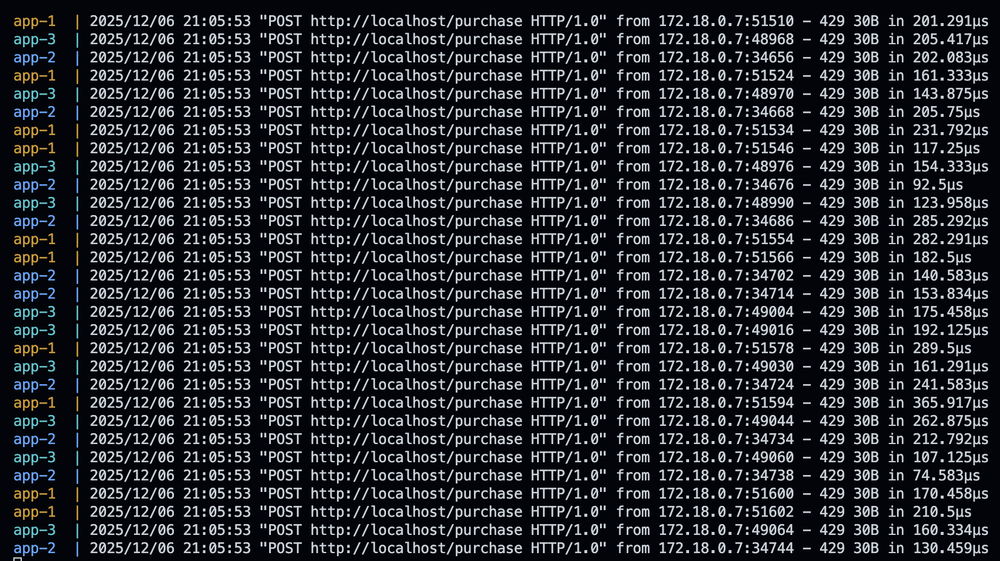
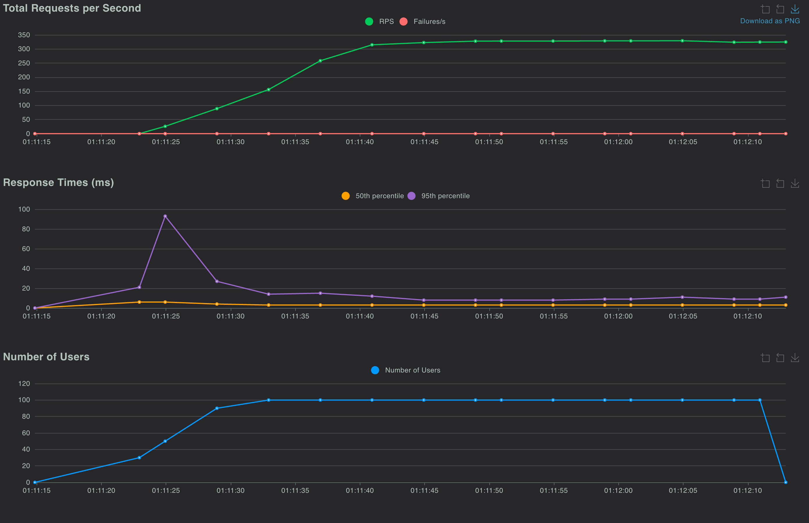
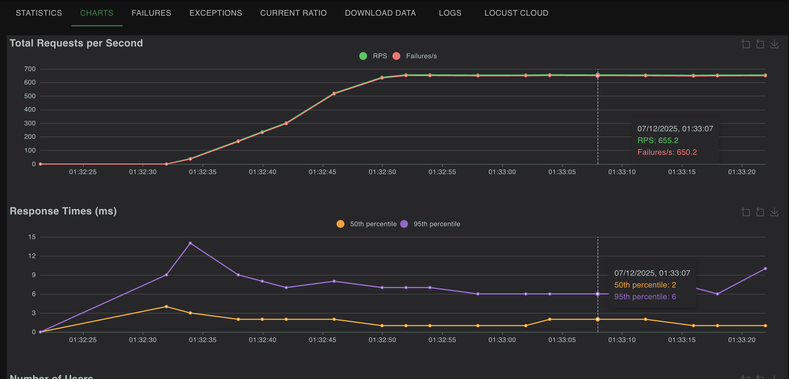
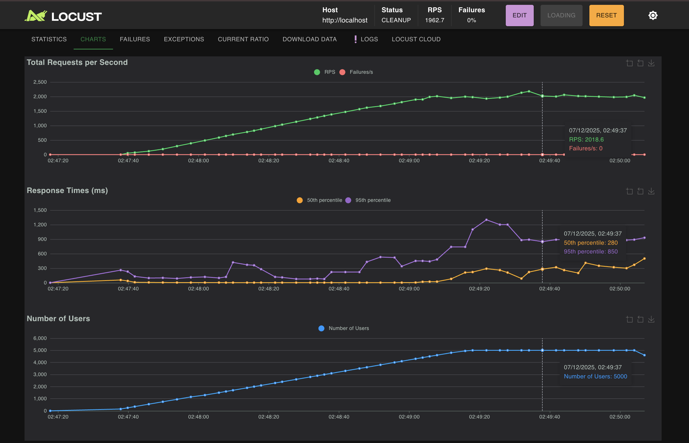
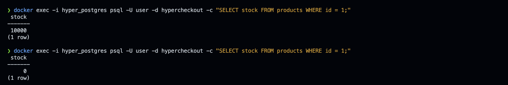

# 🛒 HyperCheckout (High-Concurrency E-Commerce System)

A strictly consistent, high-performance checkout system built to handle "Flash Sale" traffic without overselling inventory.

<p align="left">
  
  
  
  
  
  
</p>

## ⚡ The Problem
In high-demand sales (e.g., ticket drops, limited sneakers), thousands of users try to buy the same item simultaneously. Standard database logic (`if stock > 0`) fails here due to **Race Conditions**, leading to overselling (selling the same item to multiple people).

## 🛠 The Architecture & Tech Stack
* **Golang (Chi):** High-performance REST API handling business logic.
* **PostgreSQL (Pessimistic Locking):** Uses `SELECT ... FOR UPDATE` to ensure atomic inventory deduction. **Zero overselling guarantee.**
* **Redis:** Distributed middleware acting as a Rate Limiter to shield the database from spam bots.
* **Nginx:** Reverse proxy and load balancer distributing traffic across 3 Go replicas using Round-Robin.
* **Docker Compose:** Containerizes the entire stack (App, DB, Cache, Proxy) for a one-command setup.
* **Locust:** Python-based load testing tool used to simulate 5,000 concurrent users.

### Infrastructure (Proof of Load Balancing)

*Above: Nginx successfully distributing traffic across 3 isolated Go containers (`app-1`, `app-2`, `app-3`).*

---

## 🚀 Performance Benchmarks
We conducted three distinct load tests to verify system behavior under different conditions.

### Scenario 1: Unprotected DB Write Limit
* **Conditions:** 100 Users, No Rate Limiting, Stock Available.
* **Graph:** `rps-write-limit.png`

* **Result:** **~330 RPS**.
* **Analysis:** This is the physical limit of PostgreSQL's `FOR UPDATE` row locking. The database forces transactions to queue up, preventing race conditions but limiting throughput.

### Scenario 2: Redis Rate Limiter (The Shield)
* **Conditions:** 100 Users (Aggressive), Redis Middleware Enabled.
* **Graph:** `rps-rate-limit.png`

* **Result:** **~650 RPS**.
* **Analysis:** The Rate Limiter intercepts excess requests before they touch the database. Since Redis responds faster than Postgres can write, the total system throughput doubles, while the database load remains safe.

### Scenario 3: The "Flash Sale" Drain (High Concurrency)
* **Conditions:** 5,000 Users, Rate Limiter Disabled, Stock Draining to 0.
* **Graph:** `rps-read-spike.png`

* **Result:** **~2,000+ RPS**.
* **Analysis:** Once stock hits 0, the bottleneck shifts from "Disk Writes" to "CPU Reads." The system uses a "Fail-Fast" mechanism to instantly reject requests with `409 Conflict`, allowing it to handle massive traffic spikes efficiently.

---

## 🛡️ Proof of Correctness (ACID Compliance)
The ultimate test of a transactional system is whether it stops exactly at 0 without going negative (overselling).

**Scenario:** 5,000 users fighting for 10,000 items.

* **Result:** Inventory drained from 10,000 to exactly 0. Zero race conditions.

---

## 💻 How to Run

### 1. Clone and Start
```bash
git clone [https://github.com/Harschmann/HyperCheckout.git](https://github.com/Harschmann/HyperCheckout.git)
cd HyperCheckout

# Start the distributed cluster (App x3, Postgres, Redis, Nginx)
docker-compose up -d --build --scale app=3
```

### 2. Test the API (Single Request)
```bash
curl -X POST http://localhost/purchase -d '{"user_id": 1, "product_id": 1, "quantity": 1}'
```

### 3. Run Load Tests (Locust)
```bash
# Install Locust
pip3 install locust

# Run the script
locust -f load-tests/locustfile.py
```

---

## 🛠 Developer Commands (Reset & Maintenance)
If you are running repeated tests, use these commands to reset the system state.

### 1. 🔄 Reset Stock & Clear Orders
Refills the product stock to 10,000 and deletes all previous order records.
```bash
docker exec -i hyper_postgres psql -U user -d hypercheckout -c "UPDATE products SET stock = 10000 WHERE id = 1; DELETE FROM orders;"
```

### 2. 🧹 Clear Redis Cache
Resets all rate limits and bans.
```bash
docker exec -i hyper_redis redis-cli FLUSHALL
```

### 3. 🔍 Check Current Stock
View the live inventory count.
```bash
docker exec -i hyper_postgres psql -U user -d hypercheckout -c "SELECT stock FROM products WHERE id = 1;"
```

### 4. 📊 View Logs (Live)
Watch traffic hitting the 3 Go replicas in real-time.
```bash
docker-compose logs -f app
```

---

<p align="center"> Made with ❤️ by <a href="https://www.google.com/search?q=https://github.com/Harschmann">Harschmann</a> </p>
